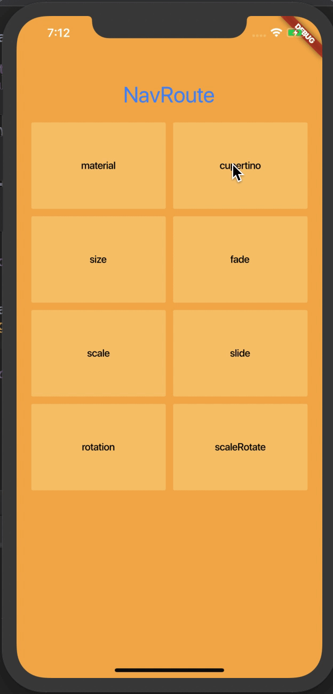
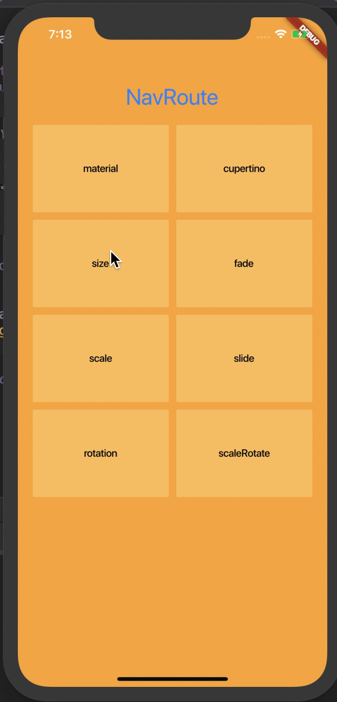
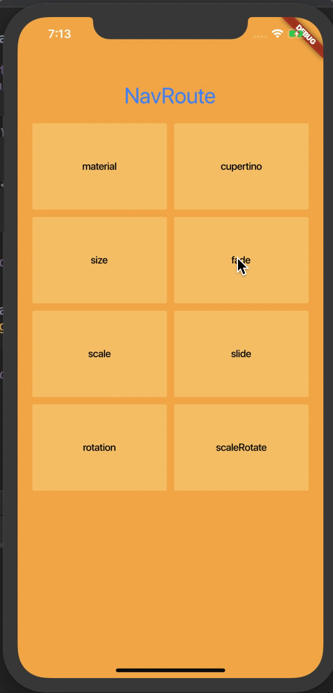
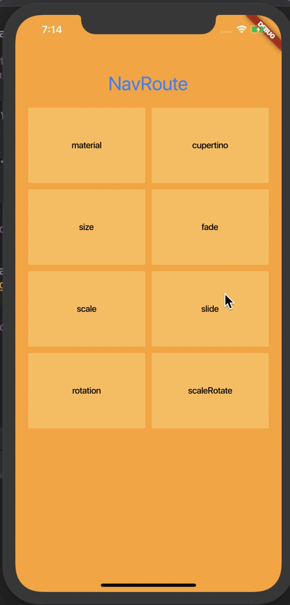

Language: [English](README.md) | [中文简体](README_ZH.md)

# nav_router

nav_router is the simplest / lightweight / convenient routing management solution for flutter. It supports various routing animations, and it is very convenient to jump / pass parameters. To jump to a new page, just routePush (NewPage ());

## Getting started

### Add dependency
```yaml
dependencies:
  nav_router: any #Specific version customization (any means latest)
```

> Related articles updated ...

Then use `flutter packages upgrade` to update flutter plugin packages

# Sample project

There is a pretty sweet example project in the example folder. Check it out. Otherwise, keep reading to get up and running.

# Setting up
*  1.Import our plugin on the page of `MaterialApp`
```dart
import 'package:nav_router/nav_router.dart';
```
*  2.Write `navGK` value in` navigatorKey` property of `MaterialApp`
```dart
  Widget build(BuildContext context) {
    return new MaterialApp(
      title: '',
      navigatorKey: navGK,
    );
  }
```
* 3.Then, we can start using it, here is an example of a jump page
```dart
Widget buildItem(RouteModel item) {
  return new FlatButton(
    onPressed: () => routePush(new NewPage()),
    child: new Text('Click to jump'),
  );
}
```

* 4.If we want to use other routing animations to jump, we can add jump properties later, such as: gradient animation
```dart
routePush(new NewPage(), RouterType.fade);
```


# Parameter passing

## Way 1：
Normally push the new page, but add Then at the back, the v behind is the data brought back by the page after we jump, and then we print it out.
```dart
routePush(NewPage()).then((v) {
  print('I received::$v');
});
```
Then our new page will pop the return value. Add our parameters directly in the pop and then the brackets. It can be any type of parameter value. After that, what we wrote above will receive the parameters we returned this time with the past.
```dart
FlatButton(
  onPressed: () {
    pop('This is the parameter');
  },
  child: Text('Return with parameters'),
),
```

## Way 2：
Method two can use our NavData, first add the NavData type parameter to the page we want to push to,
```dart
class NewPage extends StatlessWidget {
  final NavData navData;

  NewPage({this.navData});
}
```
Then the following judges whether the navData is empty, that is, whether the superior has received this method, and if so, returns it with parameters.
```dart
FlatButton(
  onPressed: () {
    if(navData == null) return;
    widget.navData('NavData mode parameter transmission');
    pop();
  },
  child: Text('Return with parameters'),
),
```
Then the place where we push can use navData to receive the value and print it out.
```dart
routePush(NewPage(navData: (v) {
    print('I received::$v');
  }),
);
```

# Effect map
||  | |
| --- | --- | --- |
||  | |
||  | |

# Flutter WeChat group


FlutterJ：www.flutterj.com

# Contributor

